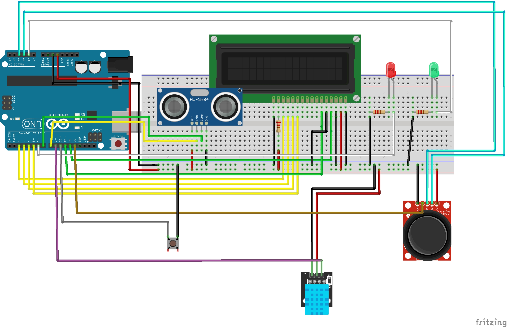
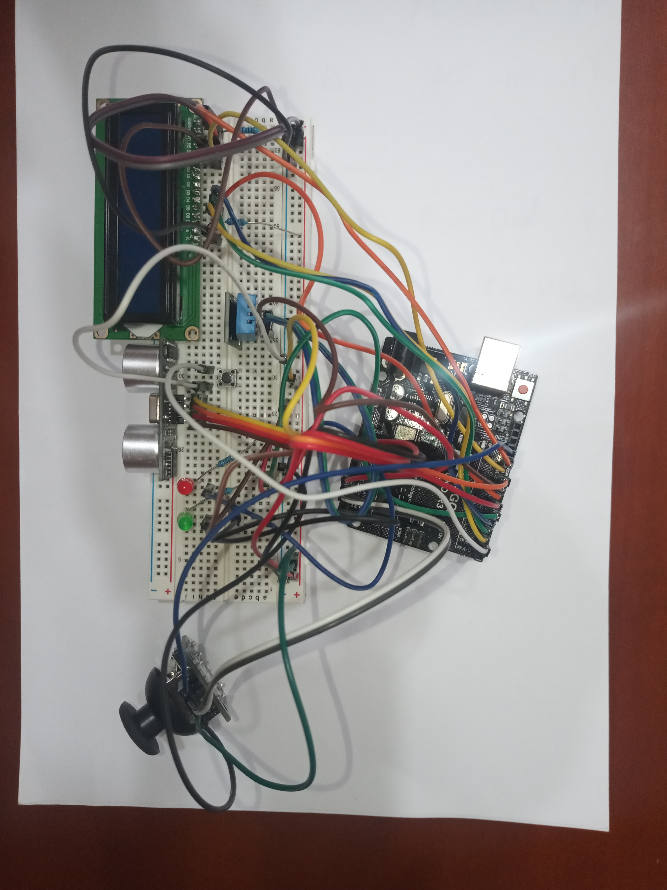

# Control for a vending machine

The points that I am going to address are the following:

* Design and assembly of the circuit.
* Code and explanation of the different functions
* Execution and video.

Here can be seen the practice statement: [***Practica3_MaquinaExpendedora.pdf***](https://github.com/iperal2021/empotrados/blob/main/docs/Vending_Machine/Practica3_MaquinaExpendedora.pdf)

## Desing and assembly 🔧

We are asked to incorporate the following components to carry out the practice:

* Arduino UNO
* LCD
* Joystick
* Temperature/humidity sensor DHT11
* Ultrasound Sensor
* Button
* Basic LED x2
  
The [*fritzing*](https://fritzing.org/) program has been used to design the circuit with the components specified above. The result is this scheme:

<center>
  
</center>

The actual circuit looks like this:

<center>
  
</center>

> The wires are new and still rigid. I know it looks bad.

Because the breadboard is completely new, contrary to what might be expected, I had difficulty placing some components, the button causing the most problems, wich comes out by itself occasionally, since it does not fit properly in some areas. of the plate.

## Code 💻

Below I am going to explain the most important functions of the code and why I have chosen to perform them in such a way.

### 1. Loop and Setup

These are the principal functions of every *Arduino* program.

In the setup function, each component and its respective pins are initialized, as well as all the threads used. To see it in greater detail see the complete code. The only thing I am going to highlight are these lines:

```c
lcd.print("Cargando...");
for (int i = 0; i <3; i++) {
    analogWrite(LED_RED, 255);
    if (millis() - tiempoInicio > 500) {
        if (digitalRead(LED_RED) == HIGH) {
            digitalWrite(LED_RED, LOW);
            Serial.println("LED OFF");
        } else {
            digitalWrite(LED_RED, HIGH);
            Serial.println("LED ON");
        }
    }
}
```

These lines turn the red LED on and off a total of three times as requested at the beginning of the program. Since this should only happen at the beginning of the program and after each restart, I have decided to put it at the end of the setup to avoid execution problems in the main loop.

The most important thing about the main loop is the following:

```c
void loop() {
  // Activamos el ultrasonidos para saber cuando hay una persona delante
  interrupts();
  ultrasonido.run();
  lcd.setCursor(0, 0);
  lcd.print("Esperando");
  admin = false;
  while (distance < 100) {
    ultrasonido.run();
[...]
```

The first of all is to activate the thread used to run the ultrasound and thus detect the presence of people at the desired distance. 

```c
if (admin) {
  menu_control(4, 3);
  admin_menu();
} else {
  menu_control(5, 4);
  cafe_menu();
}
```

With this *IF* sentence I can select the menu that is shown in the *LCD*, it depends of the admin variable. Previously I used the interruption callback to call the *admin()*, but to avoid recursion I decided to change it to that other form, using only a variable to switch between menus.

```c
if (digitalRead(BUTTON) == LOW && isPress == false) {
  timeWhenPress = millis();
  timePressed = 0;
  isPress = true;
}

if (buttonPressStartTime > timeWhenPress){
    timePressed = buttonPressStartTime - timeWhenPress;
}

if (timePressed > 5000 && isPress == true) {
  admin = !admin;
  buttonPressStartTime = 0;
  timeWhenPress = 0;
  timePressed = 0;
  isPress = false;
  lcd.clear();
} else if (timePressed >= 1000 && timePressed <= 3000) {
  resetFunc();
} else {
  buttonPressStartTime = 0;
}
```

To change between the two menus I used these two *IF-ELSE* sentences to verify and chage the value of the admin variable.

### 2. cafe_menu() and admin_menu()

These are the two functions that show the menus, as their names indicate. The two have the same structure: first, the state of the LEDs (on or off) and then the prints of the cafe list or the admin submenus.

```c
// Listas a usar durante el programa
float price_list[5] = { 1.00, 1.10, 1.25, 1.50, 2.00 };
String cafe_list[5] = { "CAFE SOLO", "CAFE CORTADO", "CAFE DOBLE", "CAFE PREMIUM", "CHOCOLATE" };
String admin_list[4] = { "Ver Temperatura", "Ver Distancia", "Ver Contador", "Modificar Precios" };

// Menu que muestras las bebidas y su respectivo precio
void cafe_menu() {
  analogWrite(LED_GREEN, 0);
  analogWrite(LED_RED, 0);
  lcd.setCursor(0, 0);
  lcd.print(cafe_list[STATE]);
  lcd.setCursor(0, 1);
  lcd.print(price_list[STATE]);
}

// Menu admin
void admin_menu() {
  analogWrite(LED_GREEN, 255);
  analogWrite(LED_RED, 255);
  lcd.setCursor(0, 0);
  lcd.print(admin_list[STATE]);
}
```

To print in the LCD the correct string and int I use the variable *STATE* wich indicate The position of the text within its respective lists.

### 3. menu_control()

To move within each menu I use this function that changes the value of the aforementioned state variable depending on the value read through the joystick.

```c
// Función de lectura del Joystick para moverse por los distintos menús
void menu_control(int a, int b) {
  X_axix = analogRead(JS_X);
  Y_axix = analogRead(JS_Y);

  // Sentencia IF usada para movernos por los menus
  if (Y_axix > 600) {
    STATE += 1;
    lcd.clear();
    delay(300);
    if (STATE == a) {
      STATE = 0;
    }
  } else if (Y_axix < 300) {
    STATE -= 1;
    delay(300);
    lcd.clear();
    if (STATE == -1) {
      STATE = b;
    }
  }
}
```

### 4. admin_selector() and serving()

As specified, we must be able to, by pressing the joystick button, choose the submenu we want to enter as admin or the coffee to serve. To do this I use the following functions, which are called within the main loop depending, once again, on the value of admin.

```c
// Submenus accesibles desde Admin
void admin_selector() {
  lcd.clear();
  switch (STATE) {
    case 0:
      show_temperature();
    case 1:
      distance_show();
    case 2:
      timer();
    case 3:
      prices();
  }
}

// Función de servicio de bebida
void serving() {
  lcd.clear();
  randNumber = random(4, 8);
  lcd.print("Sirviendo...");
  for (int i = 1; i < 255; i++) {
    analogWrite(LED_GREEN, i);
    delay(randNumber * 1000 / 253);
  }
  analogWrite(LED_GREEN, 0);
  lcd.clear();
  lcd.print("RETIRE BEBIDA");
  delay(3000);
  lcd.clear();
}

void loop() {
    [...]
    while (distance < 100) {
        [...]

      if (digitalRead(JS_DIGITAL) == LOW) {
        if (admin){
          admin_slector();
        } else {
          serving();
        }
      }

    [...]

    }
}
```

### 5. Threads

I used a total of four **threads**, two of them using the thread controller. The threads that I decide to use ar to take the lectures from the ultrasound, the dht sensor and to take the time whe the program was initialized.

The tempearature and humidity thread has the exact code except for what is shown on the LCD. With the *show_temperature()* function I run the thread controller.

```c
void temperature_thread() {
  lcd.clear();
  temperature = dht.readTemperature();
  lcd.print("Temperature:");
  lcd.setCursor(0, 1);
  lcd.print(temperature);
  delay(1500);
}

// Controller de los threads anteriores
void show_temperature() {
  lcd.clear();
  while (X_axix > 300) {
    X_axix = analogRead(JS_X);
    controller.run();
  }
}
```

The other two threads have the same estructure as the previous. I will only show the thread callback itself.

```c
void timer_thread() {
  tiempoInicio = millis();
  lcd.clear();
  lcd.print(tiempoInicio);
  delay(100);
}

void distance_thread() {
  digitalWrite(TRIGGER, HIGH);
  delayMicroseconds(10);
  digitalWrite(TRIGGER, LOW);
  duration = pulseIn(ECHO, HIGH);
  distance = duration * 0.034 / 2;
}
```

### 6. prices() and prices_change()

These two functions serve as the submenu that allows the price change of the different coffees. The first is used to choose the coffee to which we are going to change the price, and the second to make the change. I used the same structures of previous functions.

```c
// Función previa al cambio de precios para elegir a que bebida se aplicará
void prices() {
  STATE = 0;
  lcd.clear();
  bool var = true;
  X_axix = analogRead(JS_X);
  while (X_axix > 400) {
    menu_control(5, 4);
    lcd.setCursor(0, 0);
    lcd.print(cafe_list[STATE]);

    if (X_axix > 700) {
      lcd.clear();
      price_change();
    }
  }
  lcd.clear();
}

// Función que permite el cambio de precios
void price_change() {
  lcd.clear();
  while (X_axix > 300) {
    X_axix = analogRead(JS_X);
    Y_axix = analogRead(JS_Y);
    lcd.setCursor(0, 0);
    lcd.print("Nuevo Precio:");
    lcd.setCursor(0, 1);
    lcd.print(price_list[STATE]);

    if (Y_axix > 600) {
      price_list[STATE] += 0.05;
      delay(700);
      lcd.clear();
    } else if (Y_axix < 300) {
      price_list[STATE] -= 0.05;
      delay(700);
      lcd.clear();
    }
  }
}
```

## Execution and Video 📹

In this video you can see the exectuion of the programm since the start of the board. 
* First I plug the board into the power supply.
* I show the running of the distance sensor and the waiting screen.
* The coffee menu is the first shown. It can be seen the coffee list and their prices.
* Then I show how to get into the admin menu and it's options.
* Finally I use the reset function. In the video can be seen that the button and it´s interruption (that I use to calculate the time), sometimes have problems due to bounce in the initialization of the interruption itself.

https://github.com/iperal2021/empotrados/assets/113594702/f01508b7-c629-4902-9fbc-0a2e1cde6b20
