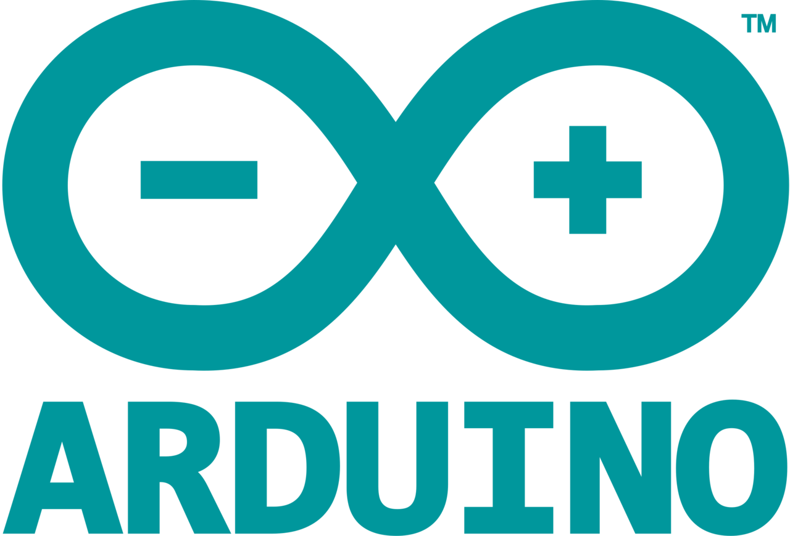

  

  

# Vending machine with [Arduino](https://www.arduino.cc/)

This page aims to serve as a memory for the third practice of the **Embedded and Real Time Systems** subject.

In this practice we must program the control of a vending machine using the Arduino microcontroller following the specifications given by the teacher.

## Arduino

*Arduino* is an **open source** electronics creation platform, which is based on free, flexible and easy-to-use hardware and software for creators and developers. This platform allows the creation of different types of *single-board* microcomputers that the community of creators can give different types of use to.

For this practice we are using the [*Super Starter Kit UNO R3 Project*](https://eu.elegoo.com/products/elegoo-uno-project-super-starter-kit) from [**ELEGOO**](https://eu.elegoo.com/)